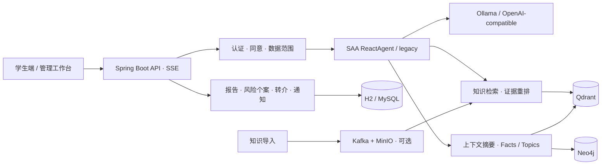

# multimodalAgent

**面向校园心理健康场景的 AI 助手：流式对话、检索增强、长期记忆与风险跟进。**

基于 Java 17、Spring Boot 和 Spring AI Alibaba，提供学生对话入口、辅导员工作台与学校运营视图，覆盖从知识检索到报告、通知和人工跟进的业务流程。

[快速启动](#快速启动) · [文档导航](docs/README.md) · [运行与配置](docs/getting-started.md) · [评测](benchmarks/README.md)

## 功能概览

| 能力 | 实现 |
| --- | --- |
| 智能体对话 | SAA ReactAgent、只读 MCP 工具、调用预算与 SSE 流式输出；保留 legacy 编排模式 |
| 检索增强 | 对话路由、Qdrant 向量召回、父章节补全、确定性重排与证据预算；支持本地 baseline |
| 长短期记忆 | 上下文预算与滚动摘要；可选 Facts/Topics、向量与 BM25 融合、Neo4j 关系扩展 |
| 知识管理 | 知识版本、索引任务与发布；可选 Kafka + MinIO 异步导入 |
| 风险跟进 | 心理状态识别、报告、Excel 导出、通知尝试记录、转介和干预记录 |
| 权限与审计 | Bearer JWT、轮换 refresh token、学生同意、角色与负责范围授权、敏感访问审计 |
| 工程支持 | Java 测试、MySQL 迁移检查、RAG/Agent 评测、可选监控与日志追踪栈 |

文本对话是核心入口；语音和视觉接口可按配置接入，模板默认使用 `WHISPER_MODE=mock` 与 `MEDIAPIPE_MODE=local-rule`。

## 架构



默认运行模式为 `AGENT_MODE=saa`。现有[验收报告](docs/reports/mindcare-agent-acceptance.md)记录了真实模型尚未达到准入阈值的项目；框架测试通过不等同于模型能力验证完成。

## 快速启动

### 1. 准备环境

安装 **JDK 17 和 Maven**，在仓库根目录创建配置文件：

```bash
cp .env.example .env
```

Windows PowerShell 使用 `Copy-Item .env.example .env`。已有 `.env` 时直接编辑，避免覆盖本地配置。

### 2. 选择运行方式

**先体验页面和业务流程（无需 Docker、Ollama 或 API Key）**：修改 `.env` 中以下配置，然后启动。

```dotenv
AI_PROVIDER=mock
AGENT_MODE=legacy
LONG_TERM_MEMORY_ENABLED=false
```

```bash
mvn spring-boot:run
```

此方式使用 H2、内存认证会话、本地知识检索、模拟回答和日志通知。首次构建仍需联网下载 Maven 依赖；mock 不代表真实模型效果。

**接入真实模型**：启动 Ollama，将 `.env` 中 `OLLAMA_MODEL` 改为 `ollama list` 中已有的模型名称，并设置：

```dotenv
AI_PROVIDER=ollama
AGENT_MODE=saa
```

再次执行 `mvn spring-boot:run`。模型需兼容所用工具调用方式，验证步骤见 [Agent 运行手册](docs/runbooks/mindcare-agent.md)。模板中的自定义 Qwen 模型需要自行准备 GGUF 权重，仓库不包含权重或微调数据集；导入方法见[运行指南](docs/getting-started.md#模型配置)。

### 3. 登录体验

打开 <http://localhost:8080>。本地模板启用以下演示账号：

| 角色 | 用户名 | 密码 |
| --- | --- | --- |
| 学生 | `student` | `student123` |
| 辅导员 / 系统管理员 | `admin` | `admin123` |
| 学校运营管理员 | `schooladmin` | `schooladmin123` |

学生首次对话前需要在页面完成隐私与敏感数据处理同意。可分别体验学生对话、管理端报告与风险个案、学校运营聚合视图。

演示账号仅用于本地体验。Docker 依赖、模型导入及通知模式见[运行与配置](docs/getting-started.md)。

## 项目结构

```text
.
├── src/main/java/         # API、认证、Agent、知识、记忆与业务服务
├── src/main/resources/    # 应用配置、数据库迁移、内置知识与 Web 前端
├── src/test/              # Java 测试
├── benchmarks/            # RAG 评测与 Agent 能力探针
├── docs/                  # 运行手册、架构决策、研究与验收记录
├── knowledge/             # 知识参考资料
├── models/                # Ollama Modelfile；权重不入库
├── observability/         # Prometheus / Grafana / Loki / Tempo / Alloy
├── scripts/               # 开发启动、模型导入、迁移检查与打包脚本
├── .env.example           # 环境变量模板
├── docker-compose.yml     # 应用与可选基础设施
└── CONTEXT.md             # 领域术语与评测约定
```

## 开发与验证

```bash
# Java 回归（与 CI 一致）
mvn --batch-mode --no-transfer-progress -DforkCount=0 test

# Python 评测器单元测试
python -m unittest discover -s benchmarks -p "test_*.py"
```

MySQL 迁移检查使用 `scripts/mysql-migration-smoke.ps1`，需要 Docker 和 MySQL 客户端。真实模型评测另外运行，参见 [RAG 评测](benchmarks/README.md)和 [Agent 能力探针](benchmarks/agent/README.md)。

## 更多文档

- [文档导航](docs/README.md)：按使用、开发和历史资料查找文档。
- [运行与配置](docs/getting-started.md)：本地开发、Docker、模型与工具模式。
- [架构决策](docs/adr/)：知识、授权、记忆、观测等设计取舍。
- [Qwen3.5 LoRA 指南](docs/qwen35-9b-bf16-lora-finetune-guide.md)：微调、合并、GGUF 转换与 Ollama 接入。
