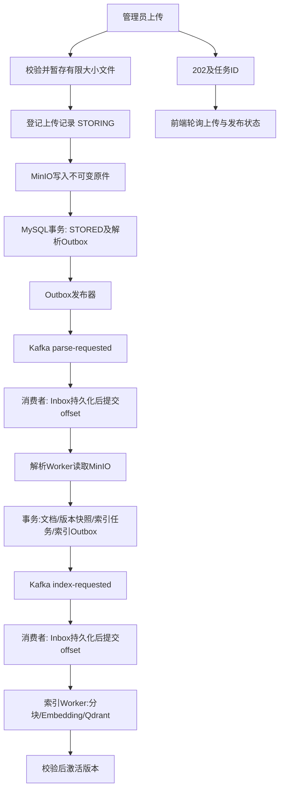

# Kafka 文件处理解耦与 MinIO 原始文件存储执行计划

日期：2026-09-12
状态：实施中；P0–P6 已完成，P7 部分完成，P8 真实全链路待外部凭证与环境验收。
适用项目：MindCare / multimodalAgent（Java 17、Spring Boot 3.5.8、WebFlux、JPA）。
目标读者：接手实现的模型及代码审查者。

## 1. 用户目标与范围

将管理员知识文件处理改为：原始文件存入 MinIO，Kafka 驱动后台解析和索引构建，前端查询异步任务状态；沿用知识版本发布与 Qdrant 检索体系。

首期支持现有 PDF、Markdown、TXT，保留单文件 10 MiB 上限。原始文件指管理员上传的知识文件；学生聊天音频、图片、视频不在本期存储改造范围。聊天、长期记忆、邮件、Excel 的任务机制不迁移到 Kafka。不要顺带修改模型、RAG策略或效果指标。

交付必须包含真实 Kafka + MinIO + MySQL + Qdrant 环境下的功能验收，不能用 mock 结果宣称接入完成。日常单元测试可替换外部依赖。

## 2. 已核对的代码基线

以下路径相对于仓库根目录，交接时须重新核对当前内容，不依赖旧行号。

| 文件 | 当前职责及改造注意点 |
| --- | --- |
| src/main/java/com/multimodalAgent/agent/controller/KnowledgeController.java | POST /api/admin/knowledge/file 使用 DataBufferUtils.join 后同步解析，返回 source/chunks；join 当前未传大小上限 |
| src/main/java/com/multimodalAgent/agent/service/knowledge/KnowledgeFileService.java | 大小/后缀校验、PDFBox逐页抽取、UTF-8文本读取，调用 KnowledgeService.ingest |
| src/main/java/com/multimodalAgent/agent/service/knowledge/KnowledgeService.java | canonical文档、内容hash、完整知识版本快照、索引任务在事务中写入；支持增删改、失败版本重试；ingestBatch还为返回片段数进行分块 |
| src/main/java/com/multimodalAgent/agent/service/knowledge/KnowledgeIndexTaskExecutor.java | 定时扫描数据库任务，租约领取，分块、Embedding、Qdrant写入、计数检查、版本激活、重试 |
| src/main/java/com/multimodalAgent/agent/domain/KnowledgeIndexTask.java | PENDING/PROCESSING/RETRY_WAIT/SUCCEEDED/FAILED、幂等键、租约、乐观锁 |
| src/main/java/com/multimodalAgent/agent/service/knowledge/QdrantGateway.java | 版本集合与索引操作，须检查重试是否重建集合及激活指针 |
| src/main/resources/static/app.js | uploadKnowledge 调用旧上传接口并读取 data.chunks，必须随接口调整 |
| src/main/resources/db/migration/ | 基线已有 V0 至 V7；本次新增 V8、V9，均保持为不可变增量迁移 |
| src/main/resources/application-local.yml | 本地降级配置；不能令已有轻量开发环境强制依赖 Kafka/MinIO |
| pom.xml、docker-compose.yml、.env.example | 基线时尚无 Kafka/MinIO 集成；实现后由本计划记录新增配置与资源 |

已有回归入口：KnowledgeManagementIntegrationTests、KnowledgeServiceTests、KnowledgeIndexTaskExecutorTests、KnowledgeChunkerTests、QdrantGatewayTests、FlywayMigrationResourceTests、DeploymentResourceTests，以及 scripts/mysql-migration-smoke.ps1。

编写计划时工作区已有多处未提交改动，涉及 Agent 模式、配置、README、Compose及测试。实现前执行 git status/diff；保留用户改动，禁止 reset/checkout 覆盖，也不要重写历史迁移。

## 3. 选定架构

采用“两阶段 Kafka 事件 + MySQL Outbox/Inbox + MinIO 原件 + 现有版本索引器”。首期不按每个chunk创建topic，也不引入分布式事务。



职责划分：

- MinIO：原始字节的权威存储；MySQL保存引用、hash、大小等元信息。
- MySQL：业务状态、文档正文、不可变版本快照、任务租约、Outbox与Inbox的权威存储。
- Kafka：跨阶段投递与消费组扩展，消息只携带标识，不传文件字节或全文。
- Qdrant：可重建的检索索引；索引未完成时继续服务旧ACTIVE版本。
- 消费者只做消息校验和Inbox事务提交，长时间解析/Embedding由有界Worker处理，避免持有Kafka poll循环等待整个版本构建。

Kafka模式下，普通业务任务只有收到对应Inbox事件才能开始。Worker调度器可扫描待执行/租约过期的Inbox恢复进度，但不得扫描所有PENDING业务任务直接执行，否则Kafka只是装饰。Outbox、恢复扫描器负责持久化交接；无需让Kafka listener fire-and-forget后依赖内存线程池。

## 4. 配置及兼容策略

新增统一开关 `multimodal-agent.knowledge.ingestion-mode`：

- `legacy`：保留现有同步文件解析和数据库索引轮询；不初始化Kafka消费者或MinIO连接。默认local/test使用此模式。
- `kafka-minio`：新异步上传契约，解析和索引经Kafka；关闭旧索引任务普通轮询入口，复用其核心执行逻辑。启动时校验必要配置，缺配置明确失败，不静默回退。

建议环境变量：KNOWLEDGE_INGESTION_MODE、KAFKA_BOOTSTRAP_SERVERS、KNOWLEDGE_PARSE_TOPIC、KNOWLEDGE_INDEX_TOPIC、KNOWLEDGE_DLT_TOPIC、MINIO_ENDPOINT、MINIO_ACCESS_KEY、MINIO_SECRET_KEY、MINIO_KNOWLEDGE_BUCKET。增加受限的worker并发、租约、重试、文件上限配置。

Kafka与MinIO配置独立于现有Agent模式、长期记忆和MCP模式。`.env.example`只能写说明或占位值；不改用户真实`.env`。为完整环境提供Compose override/profile与运行手册，明确容器地址和宿主机地址。

依赖：Spring Kafka版本跟随当前Spring Boot依赖管理；MinIO SDK显式锁定与Java 17兼容的版本。新增测试容器依赖时同样锁定兼容组合；实施时以dependency:tree、编译和容器启动核实，不直接照搬最新文档版本。

## 5. 原始文件与上传事务

### 5.1 存储边界

新增 `KnowledgeObjectStore`，提供 put/get/stat/remove；实现 `MinioKnowledgeObjectStore`。ObjectRef至少包含bucket、objectKey、sha256、size和可选versionId。

使用私有bucket；key为 `knowledge/raw/{uploadId}/original`，服务端生成，不从文件名拼接路径。原始文件名仅作元信息和下载展示。一次uploadId只对应一份内容，禁止覆盖不同字节；不要以ETag代替SHA-256。

WebFlux入口边读边限制大小并计算SHA-256，可使用受控临时文件桥接阻塞SDK；读完完整上传再确认大小，不只相信Content-Length。取消、超限和异常时释放DataBuffer/流并清理临时文件。阻塞存储/解析调用放在有界执行器，限制同时暂存文件数量。

首期只做格式与大小校验，不在HTTP请求中解析PDF、调用Embedding或分块；PDF格式无效、加密不可读、无可提取文本，在后台明确失败，不伪造OCR。

### 5.2 接收流程与补偿

1. 在接收完成、算得hash之后，短事务创建STORING记录，预留幂等键与目标source；记录预期hash/大小和确定性objectKey。
2. 事务外上传MinIO；成功后校验对象元信息。
3. 短事务将记录改为STORED，并插入唯一解析Outbox；只有事务提交后才能返回202。
4. MinIO失败：持久化STORAGE_FAILED，无解析消息；返回明确错误。
5. MinIO成功但第二个事务失败：保留STORING记录，由恢复器stat对象、校验hash/大小后补齐STORED与Outbox。不得因数据库临时故障立即删除可能已提交关联的对象。
6. 客户端未收到响应再次提交：相同用户/幂等键/请求摘要返回同一uploadId及当前状态；幂等键与不同内容/目标冲突则409。STORING阶段可返回202和当前状态或可重试状态，禁止重复分配原件。
7. 超时STORING但对象不存在：标记STORAGE_FAILED，允许相同请求显式重试存储。记录恢复动作，区分上传仍进行中与真正失联，使用存储租约避免与活跃PUT竞争。

默认不自动删除已有原件。失联原件清理先产出报告；以后增加清理时必须经过宽限期、无有效租约、无上传/文档/版本引用等检查，不能仅按对象年龄批量删除。历史文档没有原件时保持空引用，禁止将提取文本假装成原始PDF。

## 6. 数据结构与状态

以下为契约，字段名可按项目风格调整，语义不能省略。

### 6.1 knowledge_uploads

- id(UUID/public ID)、uploaded_by、original_filename、declared_content_type、size_bytes、sha256。
- bucket、object_key、object_version_id(nullable)。
- source、target_document_id(nullable)、expected_document_version(nullable)、request_hash、client_idempotency_key。
- status、attempts、next_attempt_at、lease_token、lease_until、dispatch_generation、last_error_code、last_error_message、created_at、updated_at、version。
- linked_document_id、knowledge_version_id、index_task_id(nullable)。
- 唯一约束(uploaded_by, client_idempotency_key)，状态/到期时间索引。

上传状态：STORING → STORED → PARSING → PARSED；失败分STORAGE_FAILED、RETRY_WAIT、FAILED、CONFLICT。PARSED只表示正文与版本已提交，不表示可检索。发布状态从关联KnowledgeVersion/IndexTask读取，展示INDEXING/ACTIVE/SUPERSEDED/FAILED。解析内容无变化时标记NO_CHANGE，明确无需新版本。

### 6.2 原件关联

KnowledgeDocument增加可空raw_upload_id；KnowledgeVersionDocument快照复制该引用，旧版本必须能追溯当时原件。手工文本创建无原件；正文手工编辑后清空当前原件关联，避免下载到不对应正文的原件，历史快照仍保留。

### 6.3 Outbox与Inbox

Outbox：event_id、event_type、aggregate_id、dispatch_generation、schema_version、payload_json、status、attempts、next_attempt_at、lease_token/until、published_at、created_at；唯一(事件类型, aggregate_id, dispatch_generation)。

Inbox：event_id唯一、event_type、aggregate_id、dispatch_generation、payload_hash、status(QUEUED/RUNNING/DONE/OBSOLETE)、lease_token/until、created_at/updated_at。不同payload却重用同event_id必须告警并拒绝，不能当作合法重复。

业务任务新增dispatch_generation；人工重试或一次业务重试递增并产生新eventId。消费者/Worker检查消息generation与当前任务一致。单独的Inbox持久化成功不代表业务成功。

迁移使用新的Flyway编号 V8、V9，不修改 V0-V7。V8 建立流水线状态，V9 补充 parser 版本和 buildAttempt 隔离约束；section 通过非空 `build_attempt_scope` 将 legacy 映射到固定 scope，避免 MySQL 可空唯一索引允许重复。MySQL检查真实唯一约束、索引及乐观锁，H2测试不代替MySQL验收。

## 7. Kafka事件与执行协议

首期topic：`mindcare.knowledge.parse-requested.v1`、`mindcare.knowledge.index-requested.v1`、`mindcare.knowledge.dead-letter.v1`，名称允许配置。

解析事件key用规范化source；索引事件key用知识库ID（当前单库固定 `default`）。按key分区是辅助顺序保障，最终正确性仍依赖数据库版本/租约，不能假定多个Worker完成顺序等于消息顺序。

示例：

```json
{
  "eventId": "uuid",
  "schemaVersion": 1,
  "eventType": "KNOWLEDGE_PARSE_REQUESTED",
  "aggregateId": "upload-uuid",
  "dispatchGeneration": 1,
  "occurredAt": "2026-09-12T00:00:00Z",
  "correlationId": "request-correlation-id"
}
```

索引事件aggregateId为indexTaskId。消费者根据ID读取权威记录，不接受消息指定任意bucket、URL、用户权限、文件路径或正文。

### 7.1 Outbox发布

- 业务事务内只写Outbox，不调用Kafka。
- 发布器短事务领取租约，事务外发送，等待broker确认后短事务标记PUBLISHED。
- 开启producer幂等及acks=all，但明确跨数据库/Kafka仍是至少一次，不宣称端到端exactly-once。
- 发送成功后宕机、尚未标记PUBLISHED会重复发送，由Inbox及业务幂等处理。
- Kafka不可用时保留待发送记录并退避；不能将业务上传标为已发布或丢弃事件。发布失败长期积压告警，修复后自动恢复。

### 7.2 消费与长任务

- 禁用自动offset提交；采用record listener，在Inbox数据库事务提交后才允许容器提交该条offset。具体AckMode/错误处理按项目解析出的Spring Kafka版本核对。
- 数据库不可用必须抛异常，不能吞掉后提交offset。
- 可恢复的重复消息读取已有Inbox后正常返回。
- Worker从已接收的Inbox领取任务，以短事务同时校验generation、业务状态、租约；长I/O放事务外；完成时以租约token及generation条件写回。
- 进程收到Kafka消息后、Inbox提交前崩溃：Kafka重投；Inbox提交后、offset提交前崩溃：去重；offset已提交但Worker未开始：Inbox恢复扫描继续执行。

### 7.3 重试与死信

业务重试由数据库统一控制，不同时启用Kafka长退避和数据库重试造成尝试次数倍增。

- MinIO读取/Embedding/Qdrant暂时异常：Worker短事务记录RETRY_WAIT、nextAttemptAt，将当前Inbox置DONE；到期调度器原子递增generation并写新Outbox。它不直接执行任务。
- Worker失联：已过期RUNNING Inbox/业务租约重新领取；代际和token使旧Worker不能完成状态提交。
- 无效PDF、不支持格式、超限解析正文等不可重试错误：业务FAILED，存结构化错误码，通过Outbox写失败摘要到DLT。
- 不支持schema/格式错误消息：配置反序列化错误处理；成功持久化隔离记录或确认DLT发布后才能推进offset。DLT故障时不得静默丢失。
- 人工重试受管理员权限及当前状态限制；新generation，不盲目重放旧DLT；已成功/旧版本/目标冲突返回明确结果。
- Outbox PUBLISHED长期没有Inbox时可由低频对账器重投同一eventId（Kafka保留期或配置事故恢复）；已有Inbox时不重建任务。

## 8. 解析、同名覆盖和版本正确性

抽出 `KnowledgeTextExtractor` 复用当前PDFBox/UTF-8解析；保留PDF分页分隔符以兼容页码与层级分块。对解析后字符数和处理时间设置上限，记录parser版本。不要把MinIO下载接进旧HTTP同步ingest方法造成两次解析。

新增事务入口 `ingestParsedUpload(...)`，返回结构化结果(documentId、versionId、indexTaskId、changed)，不再只返回chunkCount。该入口完成：

1. 检查解析租约及generation。
2. 检查目标文档与expectedVersion，保存canonical正文及raw_upload_id。
3. 创建完整版本快照和索引任务，同时写索引Outbox。
4. 更新upload关联及PARSED，并完成Inbox；以上是同一个数据库事务。

同名语义明确改变：新建上传遇到已存在source返回409，不再按文件名静默覆盖。替换必须显式提交targetDocumentId和expectedVersion；前端提供确认覆盖或改名操作。先按source建立独立预留记录/唯一约束，禁止两个活跃上传同时新建同source。失败终态释放预留，历史upload仍保留。

解析期间目标被管理员编辑/删除：解析提交CAS失败，upload转CONFLICT，不能恢复已删除文档或覆盖较新正文。手工增删改接口与上传预留规则保持一致。

知识库是完整快照：所有canonical变更、快照创建和版本激活须共享数据库级publication锁（可用单库singleton行锁）。不同source同时完成、删除与上传并发都不能产出遗漏快照或两个ACTIVE；不能只靠Java synchronized或Kafka单分区。

文本API、初始化知识导入、文档编辑删除、retryVersion同样会创建索引任务：kafka-minio模式下所有这些路径必须事务写索引Outbox，不能只改文件入口。

## 9. 索引执行器复用与租约边界

拆分当前KnowledgeIndexTaskExecutor：

- 核心 `KnowledgeIndexProcessor` 接受taskId/受控claim，保持层级分块、Embedding模型/维度检查、Qdrant计数校验及版本激活。
- legacy调度器继续扫描原任务；kafka-minio由Inbox Worker调用核心。两个入口受互斥配置控制。
- 现有私有claim/process逻辑可重构，但不能复制两份索引实现。

特别检查当前resetChunks/prepareVersionIndex与租约失效竞态：数据库token只能阻止最终写状态，不能撤回旧Worker已经发出的Qdrant请求。

实现要求：同一版本重试使用隔离的buildAttemptId及暂存collection/分块归属，只有仍持有租约、仍是最新版本、完整校验通过的尝试才能原子绑定最终collection并激活。旧Worker仅能写自己的暂存结果，不能清空新尝试数据或修改ACTIVE索引。需要相应扩展版本/分块字段或构建尝试表，并调整QdrantGateway与检索读取。失败暂存资源延迟回收且核对引用。

若实施者提出更小改法，必须用真实并发故障测试证明等价隔离，不能仅加入一个状态if检查便声称解决。

已SUPERSEDED的任务标记完成/过期并停止；上传界面显示“已被更新版本取代”，不永远等待其ACTIVE。已ACTIVE任务重投不能重建在线集合。索引失败不撤销旧ACTIVE版本，也不重新解析已经PARSED的原件。

## 10. API与前端契约

沿用上传路径，在kafka-minio模式返回202：

```json
{
  "uploadId": "uuid",
  "source": "campus-support.pdf",
  "status": "STORED",
  "statusUrl": "/api/admin/knowledge/uploads/uuid",
  "documentId": null,
  "knowledgeVersionKey": null
}
```

POST增加Idempotency-Key；可选source及显式替换参数。前端为一次用户上传生成并保存同一key，网络重试沿用。完整接收并保存原件仍需时间，202不是收到第一个字节就返回。

新增：

- GET /api/admin/knowledge/uploads/{id}：上传阶段、发布阶段、文档/版本关联、尝试次数、可重试性、脱敏错误；不暴露密钥、内部URL和objectKey。
- GET /api/admin/knowledge/uploads：管理员分页查询历史任务，页面刷新后可继续跟进。
- POST /api/admin/knowledge/uploads/{id}/retry：只重试存储/解析可重试失败；版本索引失败走现有版本重试接口，明确区分。
- GET /api/admin/knowledge/uploads/{id}/original：鉴权后代理下载，安全Content-Disposition及长度、类型；禁止任意对象key查询。原始bucket不公开。

前端识别202与legacy旧响应，展示上传、待解析、解析中、索引中、可检索、失败、冲突和被替代。轮询有间隔/退避，页面关闭或终态停止；刷新恢复。202不可显示“已入库可用”，chunks未知时不显示0成功。后端测试及审计字段从chunk_count迁移为upload_id/status，保留后续索引数量查询。

## 11. 权限、部署与可观测性

所有新上传、状态、重试、原件下载接口沿用ADMIN与现有审计；学生/辅导员不得绕过原件下载。应用使用受限MinIO凭证，凭证不进入事件/日志。审计记录操作人和uploadId，异步Worker沿用correlationId但不能伪造HTTP身份。

Compose：增加固定版本Kafka KRaft、MinIO、bucket/topic初始化及持久卷；提供健康检查。明确Kafka advertised listeners的容器/宿主机双访问方式；不能默认latest；开发单broker不宣称生产高可用。应用启动必须在topic/bucket初始化之后或具备明确重试。生产不提供弱默认口令。

指标至少包括：Outbox积压及最老年龄、Inbox待执行/失联数、Kafka lag、各阶段成功/失败、DLT数、解析/索引阶段耗时、MinIO失败、版本激活失败。日志关联eventId/uploadId/taskId/versionKey，正文和原件内容不写日志。不在本计划设定性能达标数值。

## 12. 分阶段实施清单

每步完成后更新本文复选框及文末实施记录，记录实际文件、验证命令、结果与阻塞原因。

- [x] P0 基线确认：读取当前AGENTS规则、工作区diff和相关源码；确认新迁移编号与依赖版本，并以 `ab5859a` 作为本次实现审查固定点。
- [x] P1 核心边界：抽取TextExtractor和索引执行核心，不改变legacy行为；解析事务入口返回结构化版本关联。相关知识管理、解析和索引测试通过。
- [x] P2 数据与原件：新增 V8/V9 迁移、Upload/Outbox/Inbox/预留与构建尝试模型、对象存储接口和MinIO实现；完成存储恢复协议。真实 MySQL migration smoke 通过。
- [x] P3 上传纵向链路：kafka-minio模式202接口、状态/下载、幂等及权限；缺消费者时只排队，不提前解析；legacy 保留。
- [x] P4 Kafka解析阶段：Outbox发布、Inbox接收、Worker解析及原子知识发布入口；加入并发source/expectedVersion保护、解析 lease 恢复和 Inbox 同事务完成。
- [x] P5 Kafka索引阶段：接通索引创建/重试入口；实现 buildAttempt 隔离、发布锁与ACTIVE保护；互斥旧调度器。
- [x] P6 重试与恢复：业务重试 generation、失联租约、毒消息/DLT、Outbox/上传恢复和手工重试；禁止隐式整链重跑；失败/失联 build attempt 具备延迟回收及 ACTIVE/运行中引用校验。
- [~] P7 前端与运维：异步UI/刷新恢复、Compose完整环境、配置说明、故障恢复/回滚runbook和阶段耗时/结果/DLT指标已交付；Outbox/Inbox积压、Kafka lag等动态队列指标尚未接入。
- [~] P8 总验收：Maven全量、真实MySQL迁移和Kafka/MinIO基础设施 smoke 已通过；真实应用 + MySQL + Kafka + MinIO + Qdrant + 实际Embedding全链路尚未执行，不能标记完成。

建议按P1、P2-P3、P4、P5-P6、P7-P8形成可审查提交；此处仅为切分建议，不要求启动并行模型或自动提交。

## 13. 验收矩阵

| 场景 | 必须观察到的结果 |
| --- | --- |
| 正常PDF/MD/TXT上传 | 202及ID；MinIO原件SHA-256一致；经两阶段Kafka形成ACTIVE版本；Qdrant检索到正文 |
| 解析/Embedding被人为阻塞 | HTTP在原件存储完成后返回202，不等待解析或Embedding |
| 同一Idempotency-Key重试 | 同一uploadId；没有第二份文档、版本或原件；不同内容返回409 |
| Kafka重复投递/重放历史event | Inbox去重；任务generation校验；ACTIVE索引不被重建 |
| Kafka在上传后不可用 | 原件/Outbox保留；恢复后继续；UI显示排队 |
| 收件数据库不可用 | Kafka offset不提前提交；恢复后可重新接收 |
| 各交接点杀进程 | PUT后、Outbox send后、Inbox commit后、解析commit后、Qdrant写后均可恢复且不重复发布 |
| 重试与租约过期并发 | 旧Worker恢复后不能覆盖新版本正文、分块或ACTIVE集合 |
| 同source并发上传 | 唯一预留或明确409；显式替换遵守expectedVersion |
| 解析时编辑/删除文档 | CONFLICT；不覆盖新正文、不复活已删除文档 |
| 不同source并发完成/版本乱序 | 全量快照无遗漏；最多一个ACTIVE；旧版本不得倒灌 |
| 无效PDF/无文本/超过限制 | 明确失败码；不建立空ACTIVE版本；流和临时文件释放 |
| MinIO暂时失败/重启 | 无虚假STORED；恢复或手工重试路径可用；成功对象不误删 |
| Qdrant/Embedding失败 | 保留旧ACTIVE；只重试索引；已有原件/正文不重跑 |
| 权限 | 未认证401、非管理员403；不能通过uploadId下载无权限原件 |
| 上传页面刷新 | 从历史任务恢复状态，202不显示可检索完成 |
| legacy与已有业务 | 无Kafka/MinIO仍可使用legacy；聊天/记忆/告警测试不回归 |
| 历史数据迁移 | 原有知识可检索，raw_upload_id允许为空，不伪造历史文件 |

测试分层：纯逻辑/状态测试、WebFlux契约与权限测试、MySQL事务和并发测试、Kafka+MinIO集成测试、真实Qdrant全链路。长模型生成不参与知识导入；Embedding可在故障测试用可控替身，但至少一次完整环境使用实际可用Embedding服务。新增测试数量按故障语义决定，不为每个getter编写测试。

执行命令基线：`mvn test`；MySQL迁移使用仓库现有smoke脚本（先读参数）；新增容器集成测试采用独立Maven profile并在runbook写出准确命令。缺Docker或外部服务时如实标记未执行，不用单元测试替代全链路完成声明。

## 14. 上线、历史任务与回滚

1. 添加兼容nullable字段和新表，先验证备份/迁移与legacy。
2. 在独立环境准备topic/bucket、凭证及真实集成测试，再启用kafka-minio。
3. 切换前暂停知识写入，等待或冻结旧索引Worker；为未完成任务生成一次迁移generation和Outbox，唯一约束保证重复执行迁移无重复逻辑任务。已ACTIVE不回填消息。
4. 切换后验证旧索引轮询关闭、Outbox正常发送、消费者正常接收、前端202流程可用。
5. 回滚优先切回新代码的legacy配置；先暂停新上传/消费者和Worker，等待租约退出。解析未完成的upload保留待恢复，不能当成传统正文任务执行。已产生的索引任务由legacy适配器接管，复用同一尝试隔离机制。
6. 配置回滚不删除Kafka消息、MinIO对象或新表。向旧二进制回滚需要额外schema/构建尝试兼容验证，不能直接启动旧worker读取新结构。

## 15. 接手模型可直接使用的指令

> 请实现本文件所述Kafka知识文件异步处理与MinIO原件存储。先核对当前代码、AGENTS和已有未提交改动，按P0-P8顺序推进。本文已确定首期范围、202接口、Outbox/Inbox、幂等、重试代际、同名覆盖及版本激活规则，常规细节可自行决定并记录，不需要重新发起需求访谈。保留用户改动及legacy模式，不修改聊天多模态/长期记忆/MCP业务，不宣称未执行的测试通过。遇到与源码冲突的设计先说明证据并修订计划；每阶段更新实施记录，最终交付代码、迁移、配置、运行手册与验收结果。不要为了接入Kafka删除现有任务租约和版本保护，也不要用仅投递日志的Kafka伪集成代替真实消费驱动。

## 16. 官方参考与版本说明

这些页面用于核对API及语义，不是本计划架构决策的来源。检索日期2026-09-12；当前Spring Kafka在线文档显示4.1.1、MinIO API显示9.0.3，均不直接视为本项目依赖选择，实施时须查阅实际解析版本的对应文档。

- [Spring Kafka 消费者容器与offset提交](https://docs.spring.io/spring-kafka/reference/kafka/receiving-messages/message-listener-container.html)：record/manual模式的提交时机、容器执行模型。
- [Spring Kafka 异常处理](https://docs.spring.io/spring-kafka/reference/kafka/annotation-error-handling.html)：异常恢复与死信处理API，按依赖版本核对。
- [MinIO Java MinioClient API](https://minio-java.min.io/io/minio/MinioClient.html)：对象上传、读取、stat及删除接口。

## 17. 实施记录

- 2026-09-12（P0）：核对现有源码、工作区改动和本地规则；以 `ab5859a` 为实现审查固定点。确认 Java 17、Spring Boot 3.5.8、Spring Kafka 跟随 Boot 依赖管理、MinIO Java SDK 8.5.17、Flyway 新迁移从 V8 开始。
- 2026-09-12（P1–P3）：新增 `KnowledgeTextExtractor`、kafka-minio 配置、Upload/Outbox/Inbox/预留/对象存储模型与 API；保留 legacy 同步路径；实现大小边界、临时文件、幂等、显式替换、管理员状态查询和原件代理下载。
- 2026-09-12（P4–P6）：实现 Kafka Outbox 发布、Inbox 去重、解析/索引有界 Worker、发布锁、generation/lease、解析失败自动重排、MinIO 存储恢复、DLT、buildAttempt 暂存集合与 ACTIVE 保护；V9 以 legacy-safe scope 隔离层级 section，持久化 parser 版本；新增过期 build attempt、chunk/section 与暂存 Qdrant collection 的延迟清理。
- 2026-09-12（P7）：更新 `docker-compose.yml`、`.env.example`、CI、异步上传 UI 和 `docs/knowledge-kafka-minio-runbook.md`；Compose 使用固定版本 Apache Kafka `3.9.0`、MinIO server `RELEASE.2024-12-18T13-46-12Z` 和 mc `RELEASE.2025-04-16T18-13-26Z`。阶段耗时/结果/DLT 指标已接入，动态队列积压和 Kafka lag 指标待补。
- 2026-09-12（P8）：`mvn -q test` 通过，最终报告为 280 tests、0 failures、0 errors、0 skipped；`pwsh -NoProfile -File .\scripts\mysql-migration-smoke.ps1 -TimeoutSeconds 240` 通过，验证 Flyway V0–V9、legacy-safe section 唯一约束与 `ddl-auto=validate`；`docker compose --env-file .env.example config --quiet`、Kafka/MinIO 隔离基础设施 smoke（Kafka healthy、三个 topic、私有 bucket）及 `node --check src/main/resources/static/app.js` 通过。因本机无 `DASHSCOPE_API_KEY`，且真实 `.env` 仍是 legacy 配置，未执行真实应用接入 MySQL/Kafka/MinIO/Qdrant/实际 Embedding 的完整验收。
